# RealSense → Unity Streaming Pipeline
### 90 Hz Depth + Colour + IMU

---

## 1. System Overview

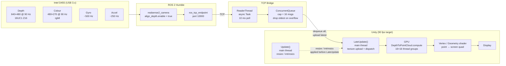

---

## 2. SimpleImageSubscriber Pipeline

Used for the calibration HUD colour overlay and AprilTag detection.

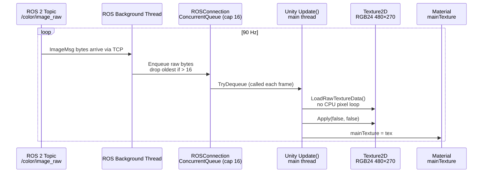

### Performance decisions

| Decision | Reason |
|---|---|
| `raw rgb8` not JPEG | `LoadImage()` (JPEG decode) blocks main thread per frame; at 90 Hz that is ~11 ms decode budget consumed before any rendering |
| No per-frame `Debug.Log` | String allocation + console write: ~270 allocs/sec at 90 Hz; triggers GC pressure and frame stalls |
| `LoadRawTextureData()` | Byte-copy into GPU memory; zero pixel-loop CPU cost compared to manual `Color32[]` iteration |
| `Apply(false, false)` | Skips mipmap generation and does not upload to GPU twice |

---

## 3. ROSPointCloudRenderer Pipeline

Full GPU point cloud: depth back-projected to XYZ on the compute shader, coloured from the aligned colour stream.

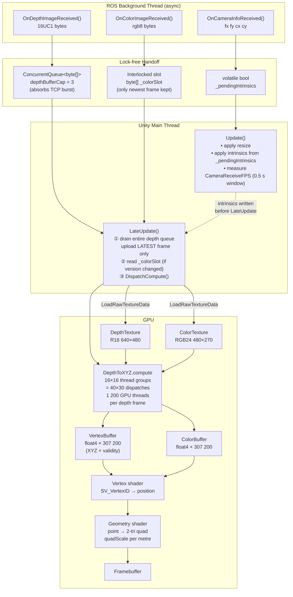

### Thread model detail

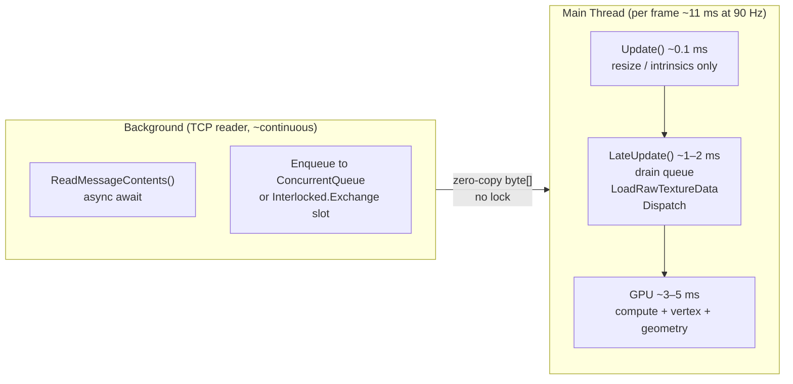

### Performance decisions

| Decision | Reason |
|---|---|
| `Application.targetFrameRate = 90` | Without this Unity targets 30 fps in builds; VSync in the editor also caps at monitor refresh |
| Depth: `ConcurrentQueue` + drain all | TCP can deliver frames in bursts; draining all and uploading only the latest ensures the point cloud is never stale and the queue cannot grow unboundedly |
| Colour: `Interlocked` single slot | Only the newest colour frame is needed; a slot exchange is O(1) and lock-free, cheaper than a queue for single-consumer single-value semantics |
| `R16` depth texture | `LoadRawTextureData` accepts the raw `uint16` bytes from the `16UC1` ROS message directly — zero CPU conversion |
| Compute shader `invFx`, `invFy` | Pre-computed reciprocals avoid per-thread GPU division (no `fdiv` in the inner loop) |
| `float4` StructuredBuffer stride | SPIR-V `std430` layout assigns `ArrayStride=16` regardless of component count; using `float3` would silently corrupt every element past index 0 on Vulkan |
| `mesh.UploadMeshData(true)` | Frees the CPU-side copy; the index buffer is immutable so this saves ~1.2 MB RAM at 640×480 |
| `ROSConnection.incomingQueueCapacity = 16` | Hard cap on the ROSConnection raw byte queue; without it the queue grows at `(90 fps − Unity fps) × topics/sec`, producing a slow-motion display seconds behind reality |

---

## 4. Combined Data Flow (wall-clock view)

```mermaid
gantt
    title Single 11 ms frame budget at 90 Hz
    dateFormat x
    axisFormat %L ms

    section Main Thread
    Update() intrinsics/resize   :a1, 0, 1
    LateUpdate() drain + upload  :a2, 1, 3
    DispatchCompute()            :a3, 3, 4

    section GPU (async)
    Compute back-projection      :b1, 4, 7
    Vertex + Geometry shader     :b2, 7, 9

    section Budget remaining
    Rendering / scripts / XR     :c1, 9, 11
```

---

## 5. Key Numbers

| Metric | Value |
|---|---|
| Depth stream | 640 × 480 × 90 Hz × 2 B = **55.3 MB/s** |
| Colour stream (raw) | 480 × 270 × 90 Hz × 3 B = **35.0 MB/s** |
| Colour stream (JPEG) | ~3–5 MB/s but adds ~5–10 ms decode/frame |
| IMU gyro | ~500 Hz, negligible bandwidth |
| GPU threads per depth frame | 640 × 480 = **307 200** |
| Frame budget at 90 Hz | **11.1 ms** total |
| Estimated compute budget used | ~4–6 ms (depth + colour upload + dispatch) |

---

## 6. AprilTag Detection Pipeline

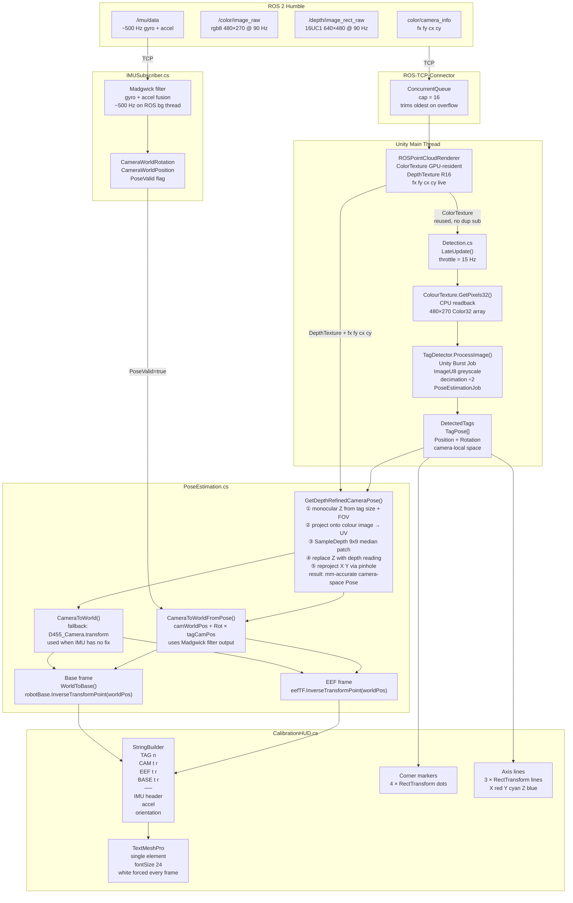

### Throttle + timing

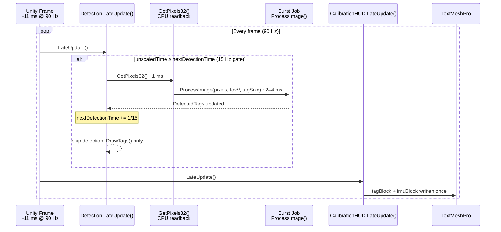

### Pose estimation math

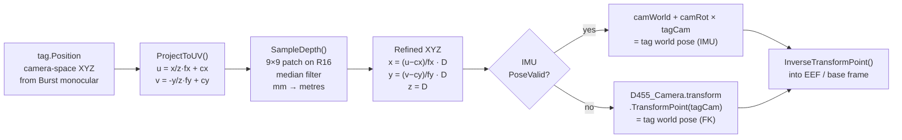

### Performance decisions

| Decision | Reason |
|---|---|
| 15 Hz detection gate | `GetPixels32()` is a full CPU readback + Burst job: ~3–5 ms; running at 90 Hz would consume the entire frame budget stalling all rendering |
| Reuse ROSPointCloudRenderer colour texture | Avoids a second ROS subscription, second TCP queue, and second GPU upload for the same stream |
| 9×9 median depth patch | Single-pixel depth on a tag centre can be occluded, noisy, or zero; the patch collects up to 81 readings and returns the median, rejecting outliers |
| IMU → world pose, not FK | FK-based `D455_Camera.transform` is static in the scene unless RobotFKSolver moves it; the Madgwick filter reflects the physical camera orientation in real-time |
| Decimation = 2 | Halves the input image to `240×135`; Burst job is 4× faster; detection quality is unchanged for tags ≥ 5 cm at < 2 m |

---

## 7. TCP Optimization

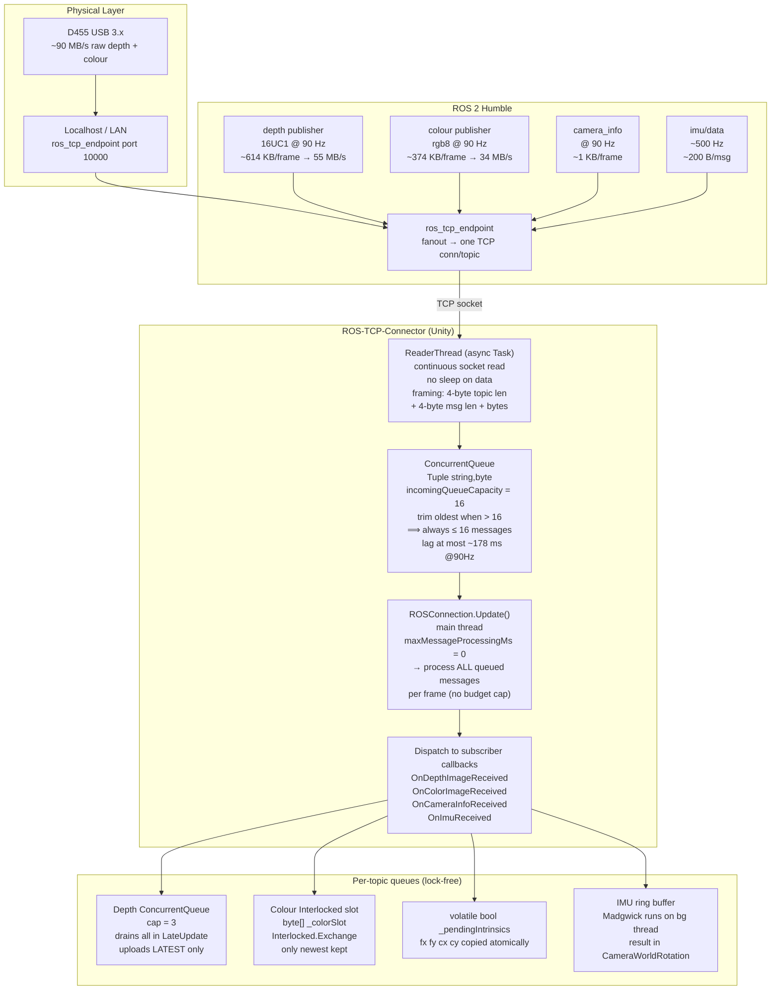

### Latency budget

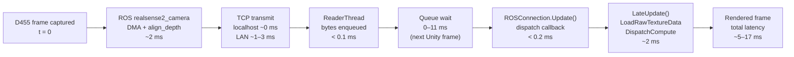

### Overflow strategy per topic

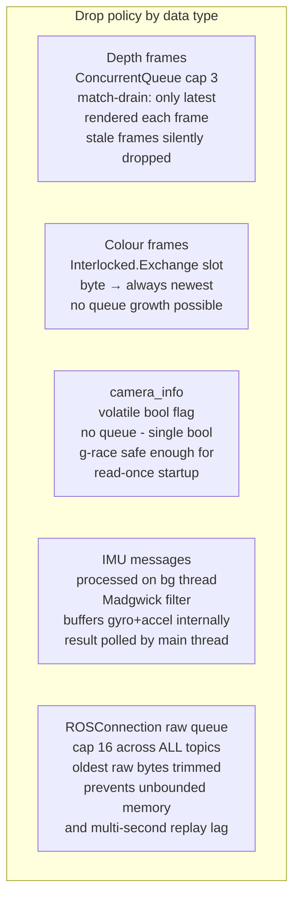

### Key parameters

| Parameter | Value | Effect |
|---|---|---|
| `incomingQueueCapacity` | 16 | Hard global cap on the ROSConnection raw byte queue; without it the queue grows at `(pub Hz − Unity fps) × nTopics`, building multi-second lag |
| `maxMessageProcessingMs` | 0 (unlimited) | Process every queued message per frame; a budget cap here would leave stale depth/colour in the queue and increase visual latency |
| Depth `ConcurrentQueue` cap | 3 | Absorbs short TCP burst jitter; `LateUpdate` drains all and uploads only the latest, so the display is never more than 1 frame stale |
| Colour `Interlocked` slot | 1 | O(1) lock-free; only the newest colour frame needed; eliminates queue allocation and GC entirely for the colour stream |
| Detection reuse of `ColorTexture` | shared ref | Zero-cost: same `Texture2D` pointer; no second TCP subscription, no second `LoadRawTextureData`, no second GPU upload |
| `align_depth.enable = true` | ROS launch | Depth → colour alignment on the D455 DSP; Unity does not need to handle depth-colour pixel registration in software |

